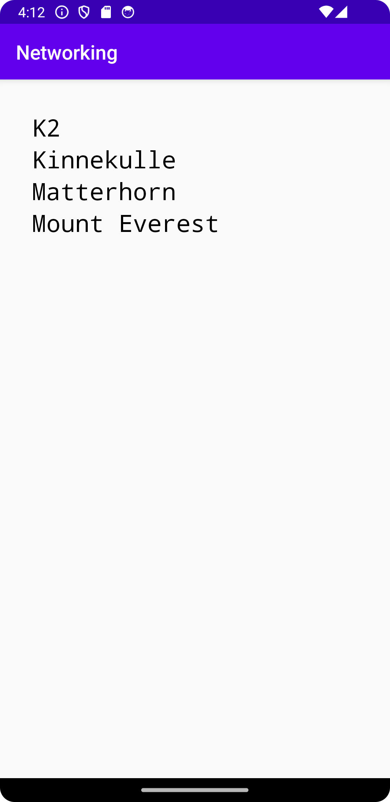

# Report

1. Created a mountain class
2. Added RecyclerView to the layout
3. Tested how demarshalling of JSON objects work, it worked well
4. Added anonymous implementation of RecyclerView.Adapter and Viewholder
5. Made it possible to display the mountain names
6. final layout configurations and source code cleanup

## Code 

### Member Variables

```java
private final String JSON_URL = "https://mobprog.webug.se/json-api?login=brom";
private final String JSON_FILE = "mountains.json";
private ArrayList<Mountain> mountainArrayList = new ArrayList<>();
private RecyclerView.Adapter myAdapter = new RecyclerView.Adapter() { ... }
```

### Adapter Implementation

```java
private RecyclerView.Adapter myAdapter = new RecyclerView.Adapter() {

    class ViewHolder extends RecyclerView.ViewHolder {
        TextView myTextView;
        public ViewHolder(View view) {
            super(view);
            myTextView = itemView.findViewById(R.id.text_view_item);
        }
    }

    @NonNull
    @Override
    public RecyclerView.ViewHolder onCreateViewHolder(@NonNull ViewGroup viewGroup, int i) {
        View view = LayoutInflater.from(viewGroup.getContext()).inflate(R.layout.recycler_view_item, viewGroup, false);
        return new ViewHolder(view);
    }

    @Override
    public void onBindViewHolder(@NonNull RecyclerView.ViewHolder viewHolder, int i) {
        ViewHolder holder = (ViewHolder) viewHolder;
        holder.myTextView.setText(mountainArrayList.get(i).toString());
    }

    @Override
    public int getItemCount() {
        return mountainArrayList.size();
    }
};

```

### Mountain class

```java
public class Mountain {

    private String ID;
    private String name;
    private String type;
    private String location;
    private int size;
    private int cost;
}
```

### Famous Peaks

```java

@Override
public void onPostExecute(String json) {

    Gson gson = new Gson();
    Type type = new TypeToken<ArrayList<Mountain>>() {}.getType();
    mountainArrayList = gson.fromJson(json, type);
    Log.d("MainActivity", json);
    RecyclerView recyclerView = findViewById(R.id.my_recycler_view);
    recyclerView.setLayoutManager(new LinearLayoutManager(this));
    recyclerView.setAdapter(myAdapter);

}

```

## IMG



